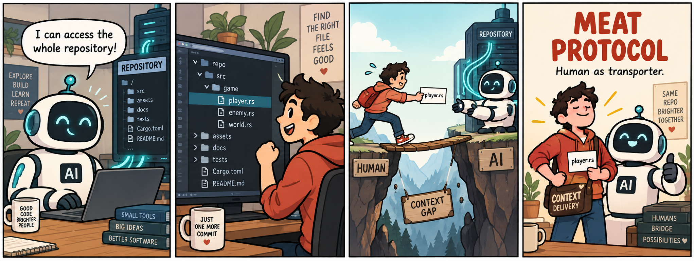

# Meat Protocol

> **Human as selector, not transporter.**

**Meat Protocol** is a small, serious-with-a-straight-face catalog of workflows where a human forms part of an information or action path between systems.

People should decide what deserves attention. The useful question is not whether people are present, but what they are doing—and which parts have become mechanical work that a system could safely take over.

## The idea in one picture

```text
Human in the path
├─ Selection   what is the target?
├─ Routing     where does it go?
├─ Transform   how does it change?
├─ Judgment    what does it mean?
├─ Approval    should it happen?
└─ Transport   how is it carried?
```

> What is the human doing in this path: selecting, routing, transforming, judging, approving, or merely transporting information?

> Which of those roles still require a human, and which have become mechanical?

## Classification is not automation

Calling a workflow Meat Protocol does **not** mean that every step should be automated, that people should be removed, or that judgment is unnecessary. Decompose the roles first; then decide separately what is technically automatable, worthwhile, safe, and desirable to keep human.

**Mechanical Human Work** is the separable mechanical portion of work performed by a human, apart from judgment, intent, or approval that may still require one.

## Start here

- [Definition](docs/definition.md) — scope, terminology, and the candidate test.
- [Principles](docs/principles.md) — the project’s point of view and non-goals.
- [Protocol catalog](examples/README.md) — the initial six examples.
- [Reference implementations](implementations/README.md) — Meat-to-Auto examples.
- [Contributing](CONTRIBUTING.md) — add a case without turning the catalog into a complaint board.

## Representative relays

| ID | Name | The unnecessary journey |
| --- | --- | --- |
| [MP-001](examples/MP-001-clipboard-relay.md) | Clipboard Relay | copy an output, then paste it into another system |
| [MP-002](examples/MP-002-file-path-relay.md) | File Path Relay | discover a file, then manually tell an agent its path |
| [MP-003](examples/MP-003-zip-shuttle.md) | ZIP Shuttle | package a project just to hand it to a system |
| [MP-004](examples/MP-004-screenshot-relay.md) | Screenshot Relay | capture a state solely to transfer it elsewhere |
| [MP-005](examples/MP-005-ai-to-ai-relay.md) | AI-to-AI Relay | shuttle unedited responses between agents |
| [MP-006](examples/MP-006-re-explanation-protocol.md) | Re-explanation Protocol | reconstruct established context in a new session |

## A comic, because this should feel slightly absurd



*MP-002 — the machine can read the repository; the human still has to carry the pointer.*

## Status vocabulary

`Common` · `Workaround available` · `Partially automated` · `Solved` · `Historical`

“Solved” and “Historical” entries remain useful: they document the Meat-to-Auto history of a UX problem and its removal.

## License

The repository content is available under the [MIT License](LICENSE).
